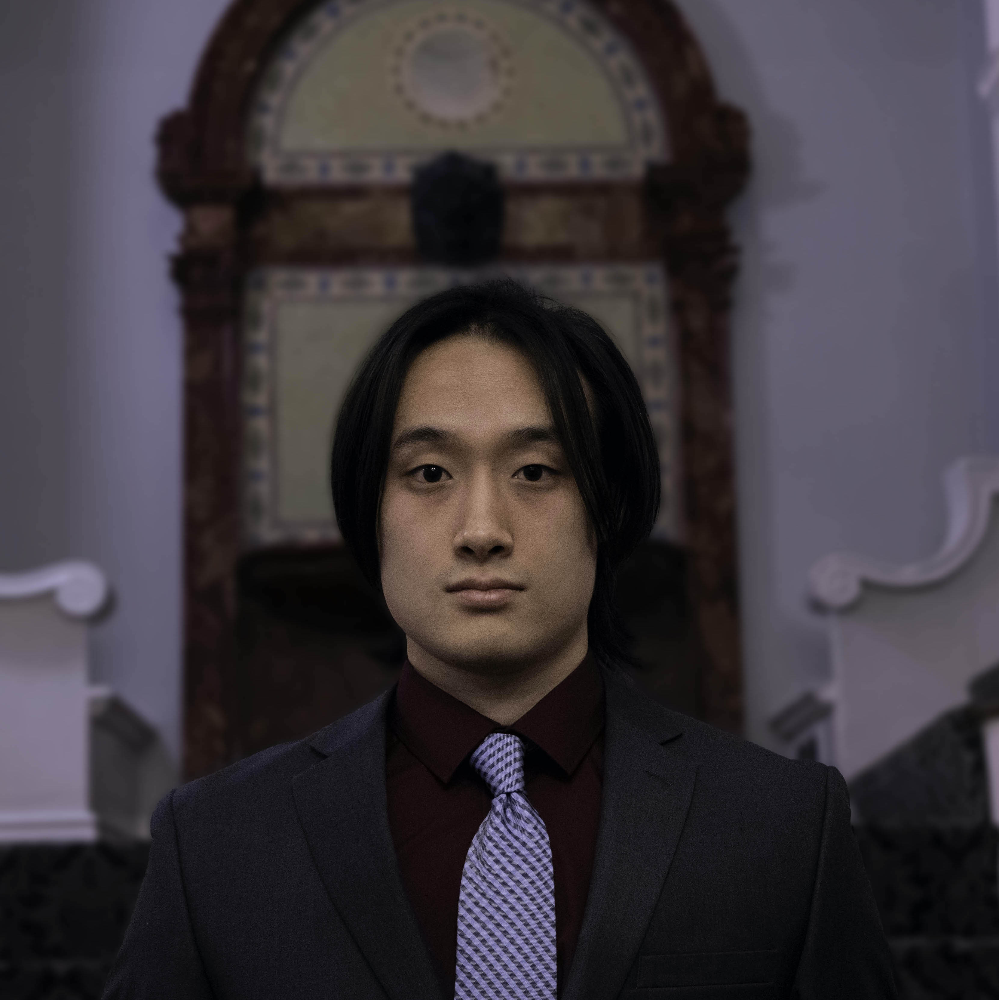
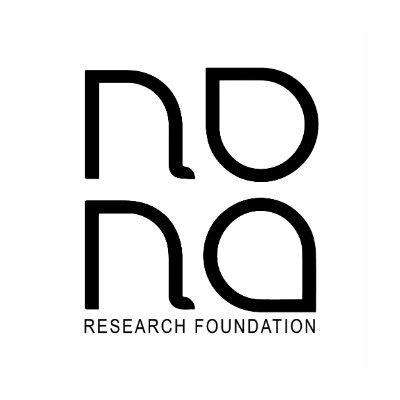
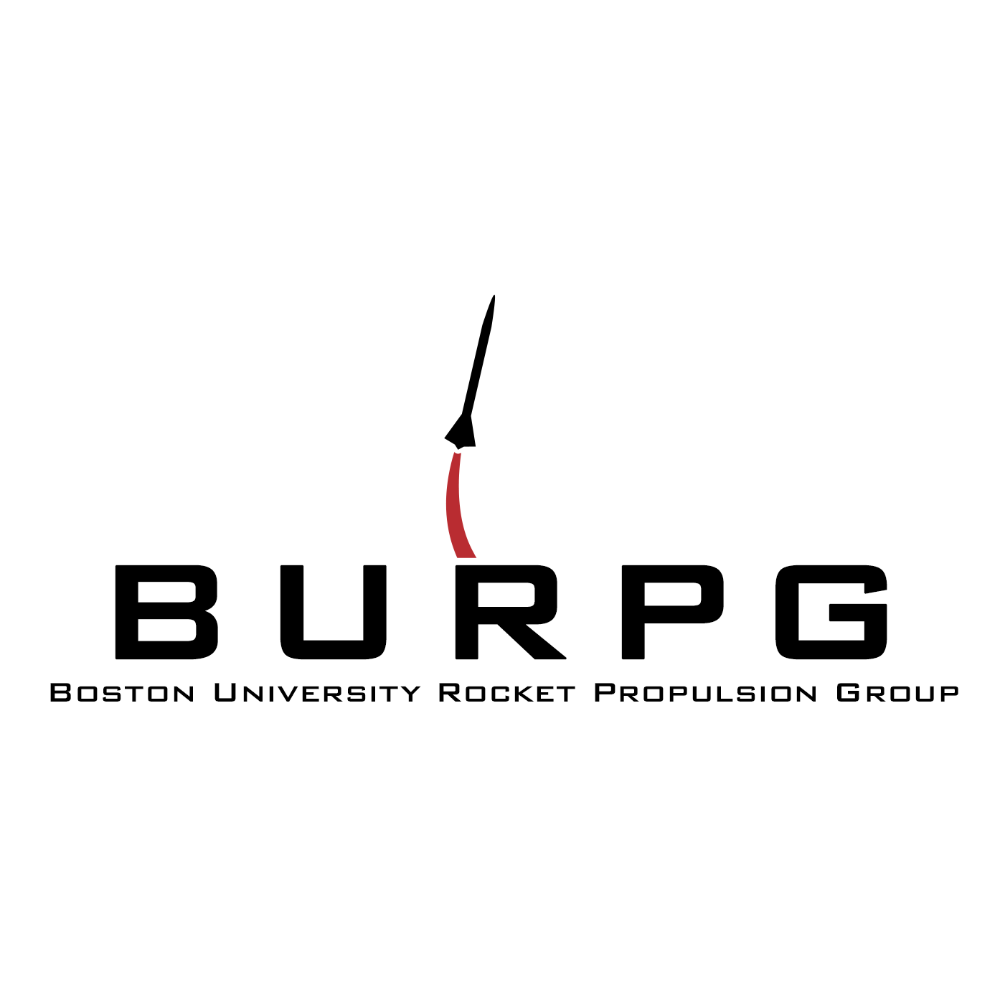

# Welcome to Ryuichi's Portfolio

Hello! 

My name is Ryuichi Ohhata, and I am a student, engineer, and hobbyist. 

## Short Bio
<timeline/>

## Professional Experience

### Hewlett Packard Enterprise (Expected)
<!--  -->
Jun - Aug, 2021 
Software Engineering Intern

### CIDAR LAB
May, 2020 -  
Undergraduate Research Assistant

<strong>Description:</strong>

<ul>
    <li>Test and evaluate software in hardware description language development research for microfluidics</li>
    <li>Generate microfluidics designs using hardware description language that is currently under development</li>
    <li>Build microservices for existing synthetic biology applications</li>
</ul>

### Human Dynamics 
Jan, 2021 -  
Contributor

### Nona Research Foundation
Feb, 2020 -  
Software Engineering Intern

<strong>Description:</strong>

<ul>
    <li>System administration works including hosting and maintaining the synthetic software tools on the Nona Research Foundation website using Docker and AWS </li>
    <li>Rehost legacy tools by using docker containers and modiftying outdated codes</li>
</ul>

### International Genetically Engineered Machine competition (iGEM) 2020
May - Nov, 2020 
Software Committee Member

<strong>Description:</strong>
<ul>
    <li>Answered technical questions from the participants</li>
    <li>Assisted teams with their GitHub repositories</li>
</ul>

### Boston University Information Services and & Technology
Jun, 2019 - May, 2020 
Web Developer Intern

<strong>Description:</strong>
<ul>
    <li>Converted old websites hosted by Boston University (BU) into new ones with the responsive framework using Wordpress and HTML </li>
    <li>Communicated with departmental faculties to assist with their websites to satisfy the requirements </li>
</ul>

### Boston University Rocket Propulsion Group
Sep, 2018 - Mar, 2020 
Software Engineering Member

<strong>Description:</strong>
<ul>
    <li>Designed and coded the electronic system for my team's rocket in the High Powered Rocketry Competition</li>
    <li>Collaborated with other members to develop hardware in the loop testing for the group's avionics</li>
</ul>

## Skills
### Programming Languages
<ul>
    <li>C/C++</li>
    <li>Java</li>
    <li>Python</li>
    <li>MATLAB</li>
    <li>PHP</li>
    <li>JavaScript</li>
    <li>SQL</li>
</ul>

### Web/ Server Technologies
<ul>
    <li>HTML</li>
    <li>CSS</li>
    <li>AWS ECR, ECS, EC2, Route 53</li>
    <li>Docker</li>
    <li>Tomcat</li>
    <li>Flask</li>
</ul>

### Database
<ul>
    <li>MongoDB</li>
    <li>PostgreSQL</li>
</ul>

### Operating Systems
<ul>
    <li>Mac OSX</li>
    <li>Windows</li>
    <li>Linus/ubuntu, debian, alpine</li>
</ul>

